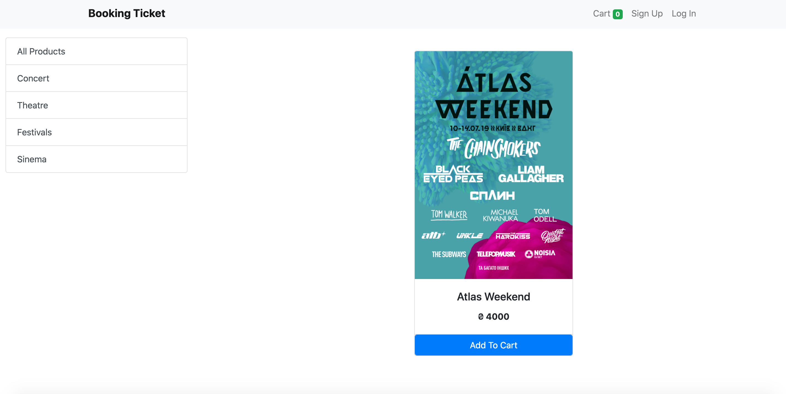

# Booking_Tiket_dj
## Django

### How To Setup
1. Clone This Project `git clone`
2. Go to Project Directory `cd Booking_Tiket_dj`
3. Create a Virtual Environment `python3 -m venv env`
4. Activate Virtual Environment `pipenv lock -r`
5. Install Requirements Package `pip install -r requirements.txt`
6. Create Migration `python manage.py makemigrations`
7. Migrate Database `python manage.py migrate`
8. Create Super User `python manage.py createsuperuser`
9. Finally Run The Project `python manage.py runserver`

